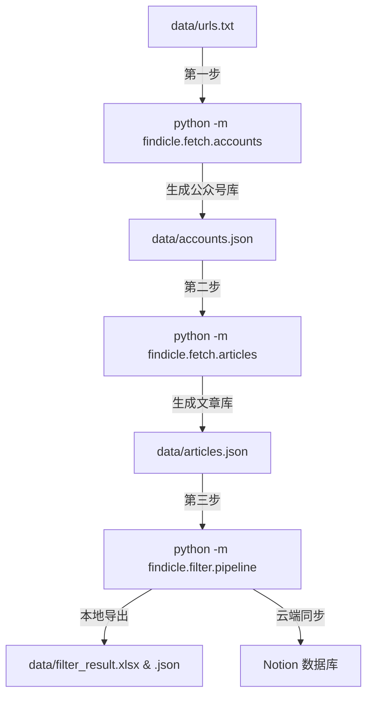

# Findicle WeChat - 微信公众号文章采集与智能筛选系统

一个模块化、高可用的微信公众号文章批量采集、日期过滤、AI 主题筛选与多端导出（Excel / Notion）系统。

## 项目特点

- **智能主题分类**：集成 DeepSeek API (JSON Mode) 对文章正文（前 800 字）进行高精度主题匹配，并内置指数退避重试机制应对网络抖动和限频。
- **流水线加速**：采用「单线程串行网页抓取（防封限流）+ 多线程并行 AI 研判（4 路并发）」流水线，总耗时基本仅受微信网页抓取限时限制，大幅度提升执行速度。
- **多样化导出**：支持一键将筛选出的文章同步至 Notion 数据库，或导出带有样式、链接及自动筛选器的专业本地 Excel 报表。
- **容错防丢机制**：对于 API 调用硬失败（如超限重试耗尽）的文章，自动将其归入「未判断」列表并单独导出至 Excel，供后续复核或重跑，确保无遗漏。

---

## 项目结构

```text
article_in_wechat/
├── .env.example             # 环境变量配置模板
├── .gitignore               # Git 忽略文件
├── pyproject.toml           # 项目打包与依赖配置文件
├── README.md                # 项目说明文档
├── topics/                  # 主题配置目录
│   └── foreign_affairs.yaml # 示例：外事主题分类配置文件
└── src/
    └── findicle/            # 主包
        ├── __init__.py
        ├── common/          # 公共基础模块
        │   ├── __init__.py
        │   ├── config.py    # 全局配置，从 .env 动态加载
        │   ├── storage.py   # 数据持久化管理（读取与存储 JSON/TXT/Excel）
        │   └── utils.py     # UA生成与网络请求头封装（内置模拟微信浏览器 UA）
        ├── fetch/           # 采集模块
        │   ├── __init__.py
        │   ├── accounts.py  # 解析待采链接，抓取 fakeid 并同步到 accounts.json
        │   └── articles.py  # 采集注册公众号最新文章，与历史合并去重后排序保存
        ├── filter/          # 过滤与分类模块
        │   ├── __init__.py
        │   ├── choose_date.py# 日期汇总与区间展示工具
        │   ├── extractor.py  # 微信网页正文解析提取（BeautifulSoup）
        │   ├── classifier.py # DeepSeek API 主题分类与指数退避重试
        │   ├── pipeline.py   # 筛选主控制台（交互式选择主题、日期、执行流水线）
        │   └── topics.py     # 加载与解析 YAML 主题配置文件
        └── output/          # 导出模块
            ├── __init__.py
            ├── excel.py     # 格式化导出至 Excel (openpyxl)
            └── notion.py    # 结果同步至 Notion 数据库 (Notion API)
```

---

## 运行环境与配置

### 1. 依赖安装

本项目使用 `pyproject.toml` 管理依赖，建议在虚拟环境（如 Conda 或 venv）中运行。

在项目根目录下，执行以下命令以可编辑模式（Editable Mode）安装项目及其所有依赖：

```bash
pip install -e .
```

### 2. 配置环境变量

在项目根目录下复制配置文件模板为 `.env`：

```bash
copy .env.example .env
```

打开 `.env` 并填入相应的 API 密钥：

```ini
# 第三方文章抓取 API 的认证密钥
X_AUTH_KEY=YOUR_X_AUTH_KEY_HERE

# DeepSeek API 密钥（用于 AI 主题分类）
DEEPSEEK_API_KEY=YOUR_DEEPSEEK_API_KEY_HERE

# Notion API 配置（可选，若同步到 Notion 则需配置）
NOTION_TOKEN=YOUR_NOTION_TOKEN_HERE
NOTION_DATABASE_ID=YOUR_NOTION_DATABASE_ID_HERE
```

---

## 使用流程

运行过程中产生的数据会统一保存在根目录下的 `data/` 目录中。



### 第一步：获取公众号 FakeID

1. 在项目根目录下创建 `data/` 文件夹。
2. 新建并写入 `data/urls.txt`，粘贴待采集的公众号文章链接（每行一个）。
3. 运行以下命令，解析链接得到公众号的 `fakeid` 并记录去重，同步到 `data/accounts.json`：
   ```bash
   python -m findicle.fetch.accounts
   ```

### 第二步：获取最新文章列表

运行以下命令。系统将遍历已采集到的公众号，爬取它们最新的文章列表并与本地历史数据进行合并、去重。在提示时输入目标年月（如 `2026-05`），程序会在爬取结束后输出全部公众号的日期覆盖情况统计：

```bash
python -m findicle.fetch.articles
```

汇总的文章列表最终将按公众号与日期排序，保存到 `data/articles.json` 中。

### 第三步：交互式主题筛选与分类

运行筛选流水线：

```bash
python -m findicle.filter.pipeline
```

根据屏幕提示交互操作：

1. **选择筛选主题**：系统会自动扫描 `topics/` 目录下的 `.yaml` 配置文件，并列出供选择。
2. **输入起止日期**：输入筛选的时间范围（格式如 `2026-04-01` 至 `2026-04-30`）。
3. **流水线运行**：系统将逐篇抓取指定日期范围内的文章正文（加入 1s - 2s 随机延迟防止封禁），并在后台多线程调用 DeepSeek API 进行主题分类。
4. **选择结果去向**：
   - **选择 1**：同步写入 Notion 数据库（如「院系外事收集」）。
   - **选择 2**：写入本地 `data/filter_result.json`，并自动导出格式优雅、附带可点击链接与自动筛选器的 `data/filter_result.xlsx` 电子表格。

> [!WARNING]
> 如发生 DeepSeek API 超时、高频限速（429）等网络硬失败且重试次数用尽，为防止漏掉符合条件的内容，未被 AI 研判的文章会单独保存到本地 `data/filter/` 目录下的 `*_undetermined.xlsx` 文件中，提示用户进行人工复核。

---

## 自定义与高级功能

### 1. 自定义 AI 筛选主题

在 `topics/` 目录下创建一个新的 `.yaml` 配置文件即可。YAML 结构如下：

```yaml
name: "科研成果"

# 核心判断标准（可选，作为全局分类约束）
principle: "文章主体必须报道的是本单位的科研工作、成果或学术产出。"

# 应该包含的细分类别
categories:
  - "在国际高水平期刊上发表论文"
  - "荣获国家或省部级科研奖项"
  - "获得或申请发明专利"

# 应该排除的混淆情况（可选，可大幅减少误判）
exclusions:
  - "非本单位人员的成果展示"
  - "仅为普通学术讲座或研讨会预告"
```

### 2. 独立导出/查看上次筛选结果

若要重新将本地已有的 `data/filter_result.json` 导出为 Excel 文件，可以直接运行：

```bash
python -m findicle.output.excel
```

---

## Notion 同步配置指南

若需启用同步 Notion 功能：

1. 前往 [Notion Integrations](https://www.notion.so/my-integrations) 创建一个新的 Internal Integration，获取 Token。
2. 打开目标数据库页面，点击右上角的 `···` -> `Connections` -> `Add connections`，搜索并添加刚才创建的 Integration。
3. 确保你的 Notion 数据库包含以下名称与类型的字段（与代码中的映射保持一致）：
   - `标题` (Title / 标题)
   - `作者` (Rich Text / 多行文本)
   - `日期` (Date / 日期)
   - `网址` (URL / 网页链接)
   - `理由` (Rich Text / 多行文本)
4. 将 Integration Token 与 Database ID 写入项目根目录的 `.env` 配置文件中。

---

## 致谢与声明

- 本项目的公众号信息获取与文章列表爬取 API 基于 [wechat-article-exporter](https://github.com/wechat-article/wechat-article-exporter) 项目提供的接口，感谢原作者的开源贡献。
- 本项目仅供学术研究和个人学习使用，请遵守相关网站服务条款。
